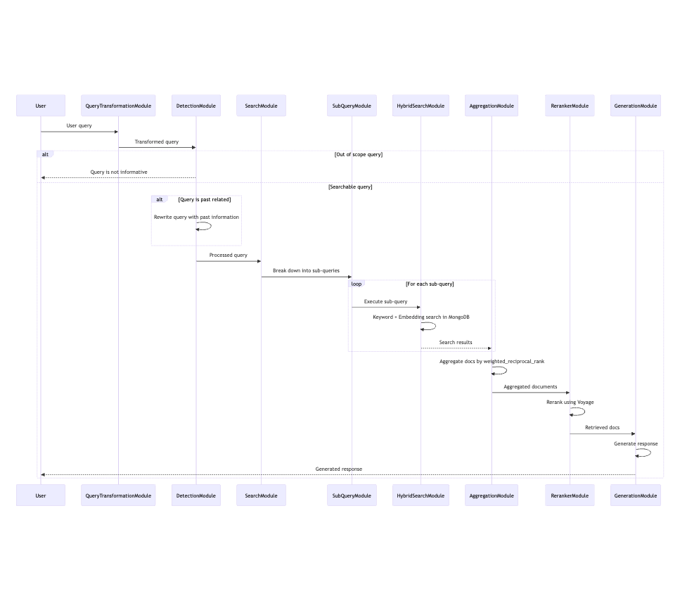
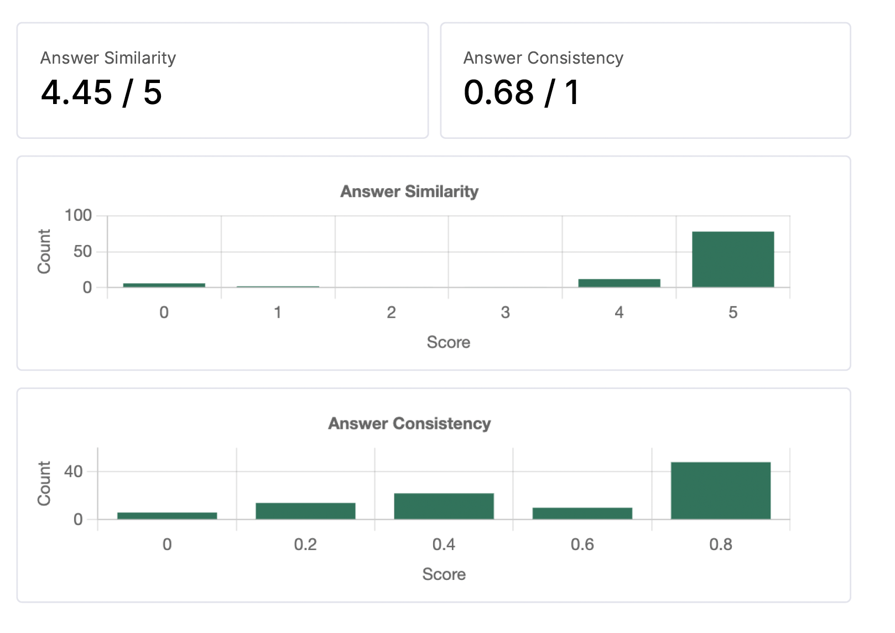
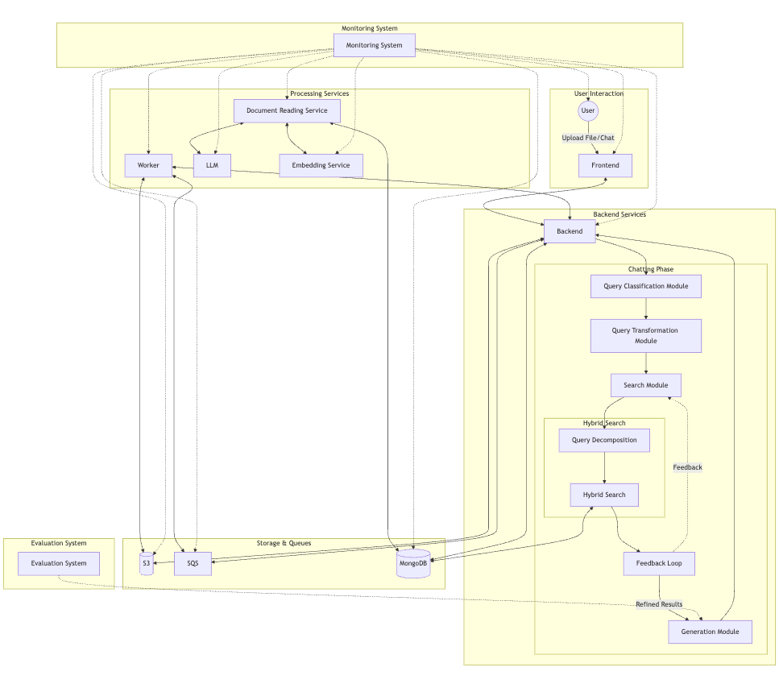

# **Hallucination Problem LLM**

## Problem Analysis

Large Language Models (LLMs), like GPT-4, can sometimes generate "hallucinations"—outputs that contain inaccurate or made-up information not grounded in the input. These hallucinations typically arise in scenarios such as:

1. Invention of facts or details
2. Incorrectly referencing sources or data
3. Creation of fictional entities or events
4. Logical contradictions within the generated content

Hallucinations can appear as:

* False information about real-world topics
* Fabricated references or sources
* Inaccurate portrayals of known concepts
* Confident responses that are factually incorrect

## Techniques to Reduce Hallucination with RAG

### Query Transformation

The QueryTransformationModule can help reduce hallucinations by ensuring the input query is well-formed and unambiguous. This could involve:

* Expanding abbreviations
* Resolving co-references
* Adding context or clarifying terms

### Query Scope Detection

The DetectionModule can prevent hallucinations by:

* Identifying out-of-scope queries and informing the user instead of generating potentially false information
* Rewriting past-related queries with appropriate temporal context

### Sub-Query Generation

The SubQueryModule can break down complex queries into simpler sub-queries. This can help:

* Retrieve more relevant information
* Reduce the chance of misinterpreting the original query

### Hybrid Search

The HybridSearchModule combines keyword and embedding search in vector database. This approach can:

* Improve retrieval accuracy by leveraging both semantic and exact matching
* Reduce the likelihood of retrieving irrelevant or tangentially related information

### Reranking

The RerankerModule uses service like Voyage for reranking. This additional step can:

* Further refine the relevance of retrieved documents
* Push the most pertinent information to the top, reducing the chance of using less relevant content in generation

### Controlled Generation

* Fact-checking against retrieved documents
* Implementing a confidence scoring system for generated responses, allowing the system to express uncertainty when appropriate
* The system's ability to rewrite queries with past information, which can help prevent hallucinations.

### Content-Aware Processing

* The system distinguishes between different types of content (e.g., text vs. tables) and processes them accordingly.
* This approach ensures that different types of information are represented appropriately in the knowledge base.

### Prompt Techniques

- Multi-step reasoning
- Confidence scoring on retrieved information, potentially flagging low-confidence responses that may be prone to hallucination
- Multiple model cross-checking: The aggregation prompt compares answers from two different models, which can help identify and reconcile inconsistencies or hallucinations from a single model

## Implementation

1. User sends a query to the system.
2. The query is transformed by the QueryTransformationModule for better processing.
3. DetectionModule checks if the query is within scope and searchable.
4. If searchable, the query is broken into sub-queries by the SearchModule.
5. HybridSearchModule executes the sub-queries using both keyword and embedding search in vector database.
6. AggregationModule combines the search results.
7. RerankerModule reranks the aggregated results to prioritize relevance.
8. Feedback Loop: Confidence scoring is applied to the reranked results. If confidence scores are low, the search strategy is refined, or additional context is requested from the User.
9. GenerationModule generates a response based on high-confidence results.

## Demo

```bash
# Navigate to the rag_app directory
cd rag_app

# Replace openai-api-key in quest_1/rag_app/chatchat_server/chatchat/configs/model_config.py

# Start the application using Docker Compose
docker-compose up
```

Video: https://drive.google.com/file/d/1TwqNVuoBA_14K4oM9kV5PvJ-d-F3XkbC/view?usp=sharing

## Evaluation

Achieve nearly 90% accuracy (with GPT-4o-mini) compared to previous results: [https://x.com/srijankedia/status/1760852271527538866](https://x.com/srijankedia/status/1760852271527538866). According to the post, on FinQABench, even the best LLMs today, such as GPT-4 and Google's Gemini Pro, achieve only 79% and 73% accuracy, respectively, despite using RAG.

**Metrics Description:**

* **Answer Similarity Score** : Measures how closely the LLM answer aligns with the reference answer. The score ranges from 0 to 5.
* **Answer Consistency** : Evaluates whether the LLM answer contains information derived from the provided context. Calculated as (Count of main points in the answer attributed to context) / (Total count of main points in the answer).

Link for my evaluation results: https://drive.google.com/file/d/1paUzjRB7Glv6CRYEpk0PV_n0QQe-F2k_/view?usp=sharing



## Serving

The serving pipeline in this system consists of two main phases: uploading and chatting.

- In the uploading phase, files are received by the File Upload Service, stored in S3, and processed concurrently. Document Reading Service splits the documents into pages, chunks the content using an LLM, and generates embeddings via Embedding Service, all of which are then stored in MongoDB.
- The chatting phase begins when a user query is received. It goes through query classification and transformation before entering the search module. Here, the query may be decomposed and processed through a hybrid search combining keyword and embedding techniques. A feedback loop refines the search results, which are then used by the Generation Module to produce the final response.
- Throughout both phases, a Worker processes tasks from an SQS queue, handling file processing and other background jobs. The entire pipeline is monitored by a dedicated Monitoring System, with an Evaluation System assessing overall performance. This architecture is designed for high performance with each component optimized for speed and efficiency.


