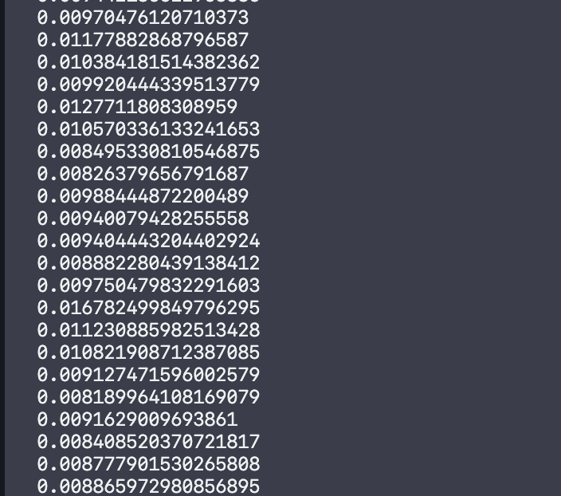
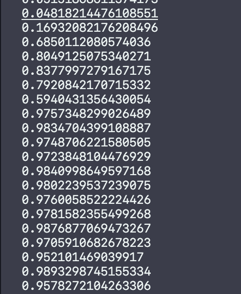
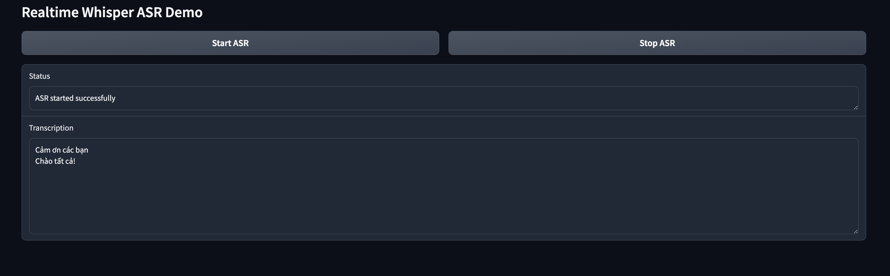
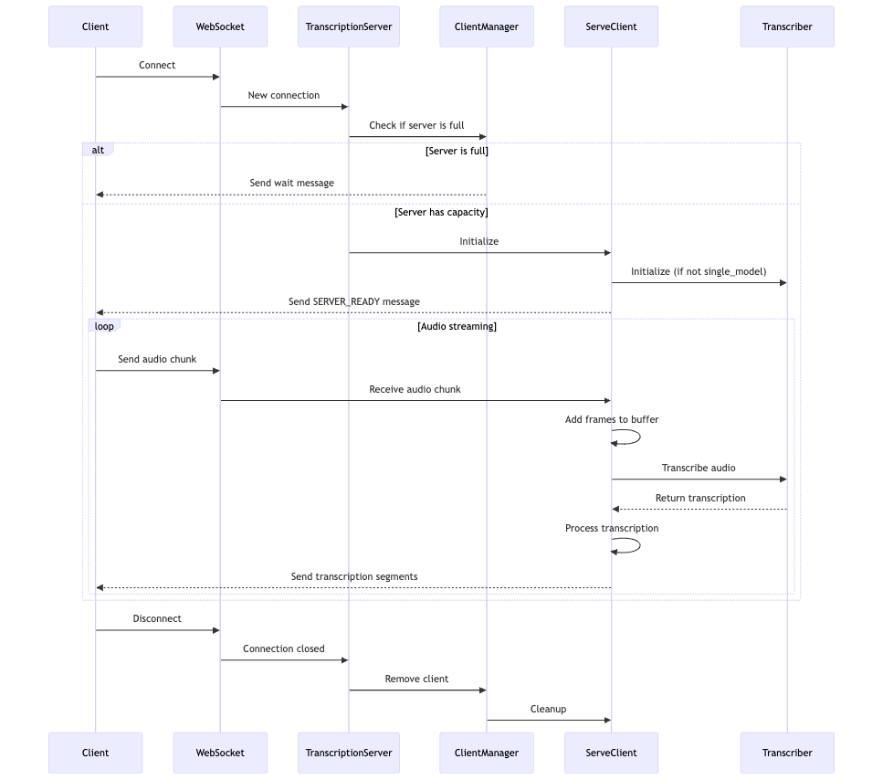

# Ghost Results in Speech-to-Text

## Problem Analysis

Speech-to-Text (STT) models, such as Whisper, can produce "ghost results" or hallucinations when processing audio segments without speech or containing speech disfluencies. These issues include:

1. Filler words (e.g., "um," "uh," "like")
2. Hesitations
3. Repetitions
4. False starts

Ghost results often manifest as:

- Repetitions of text from previous audio chunks
- Shuffled versions of previously transcribed content
- Completely unrelated text insertions

## Techniques to Reduce Ghost Results

### Hyperparameter Setting

- Adjust decoding parameters like beam size, temperature, and top-k/top-p sampling.

### Noise Reduction

- Apply Voice Activity Detection (VAD) and combine speech segments before transcribing with the Whisper model.

### Confidence Scoring

- Compute word logprobs by analyzing token logprobs generated by the model.

### Detecting Disfluencies

- Identify disfluencies by detecting multiple peaks in attention weights and recalculating token starting points.

## Implementation

The Transcriber starts two threads:

- Voice Activity Detection (VAD) thread continuously reads audio from the audio streaming source ( ormicrophone)
- When speech is detected, it sends the audio to the ASR thread for transcription using the Whisper model

## Demo

## 1. Speech Probability (No Voice)

## 2. With Voice

## 3. Demo Result: Speech-to-Text

## Evaluation

| Model                                                                 | WER   | CER   | NORMALIZED WER | NORMALIZED CER |
| --------------------------------------------------------------------- | ----- | ----- | -------------- | -------------- |
| whisper-tiny_pipeline (normal whisper)                                | 64.29 | 31.63 | 60.0           | 29.45          |
| whisper-tiny_whisper (time alignment + hyper parameter setting)       | 64.29 | 31.63 | 60.0           | 29.45          |
| whisper-tiny_whisper (time alignment + VAD)                           | 68.57 | 35.03 | 64.29          | 32.88          |
| whisper-tiny_whisper (time alignment + hyper parameter setting + VAD) | 62.86 | 28.57 | 52.86          | 25.68          |

## Serving

When a client connects, the TranscriptionServer checks with the ClientManager if there's capacity:

- If the server is full, the client receives a wait message.
- Otherwise, a ServeClient instance is initialized for the client. The client then receives a SERVER_READY message.

In a continuous loop, the client streams audio chunks via WebSocket to ServeClient, which buffers the frames and sends them to the Transcriber. The Transcriber returns transcriptions, which ServeClient processes and sends back to the client as segments. This loop continues until the client disconnects. Upon disconnection, the TranscriptionServer notifies the ClientManager to remove the client, and the ServeClient instance is cleaned up. This pipeline enables efficient, scalable, real-time audio transcription with built-in load management.

